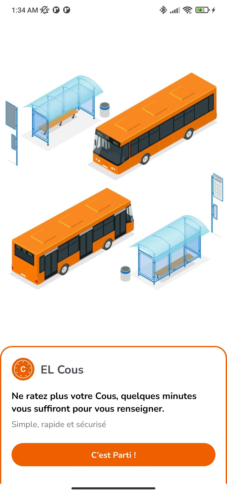
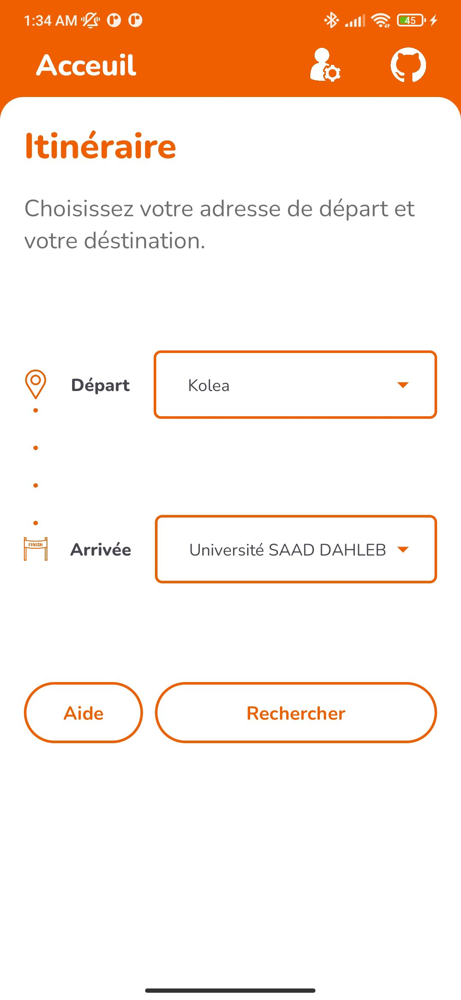
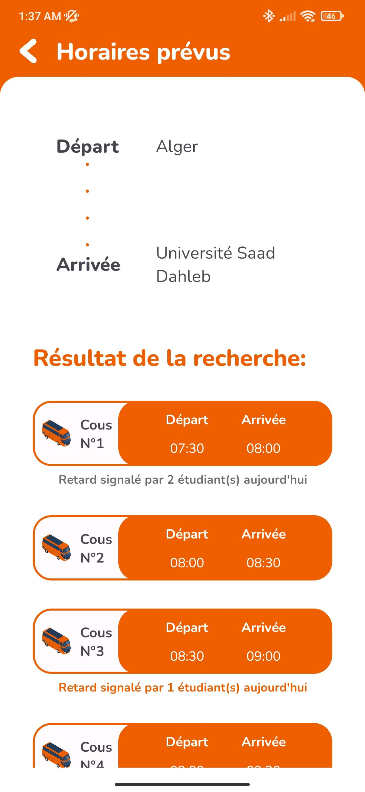

  

# EL Cous
EL Cous is an Android native unofficial app for local algerian universities' bus transport scheduling, it gives the ability for users (mainly students) to view the bus schedules, which aren't officially available anywhere else. It also lets them report delays or when busses are late to spread information.

The schedules should be moderated either by volunteers or administrators, can be easily done through the app.

# Screenshots
||||
|---|---|---|

# Features
- Ability to view all available routes and their schedules
- Ability to report bus delays (gets automatically cleared daily)
- Admin panel accessed using an admin key
- Currently only localized to french (might or might not add english localization)

# Build
Simply cloning and building with android studio should do the trick, make sure to use the latest androidx libraries.

See hosting instructions below for more info.

# Hosting
This app is hosted on a Firebase instance, uses anonymous auth and the Firestore Database.

To host it with another Firebase instance, delete `./app/google-services.json` and replace it with your own generated one.
The Firestore Database also needs to be initialized with an admin key as a string value with the field `admin_key` in the path `~/app/data`, and atleast one document in a collection called `trajets`, further configuration can be done from within the app's admin panel.

If the app shows an error on the home screen, recheck the above instructions, the app locks the user if the `trajets` collection returns no documents, *definitely for security reasons*.

# DISCLAIMER
- Since i don't count on updating this on the future and due to the lack of time, i did not follow code architecture standards such as MVVM.
- This is NOT a service, just a small demo for my mobile dev course, I do not advice using the code as an example and cannot guarantee anything.
